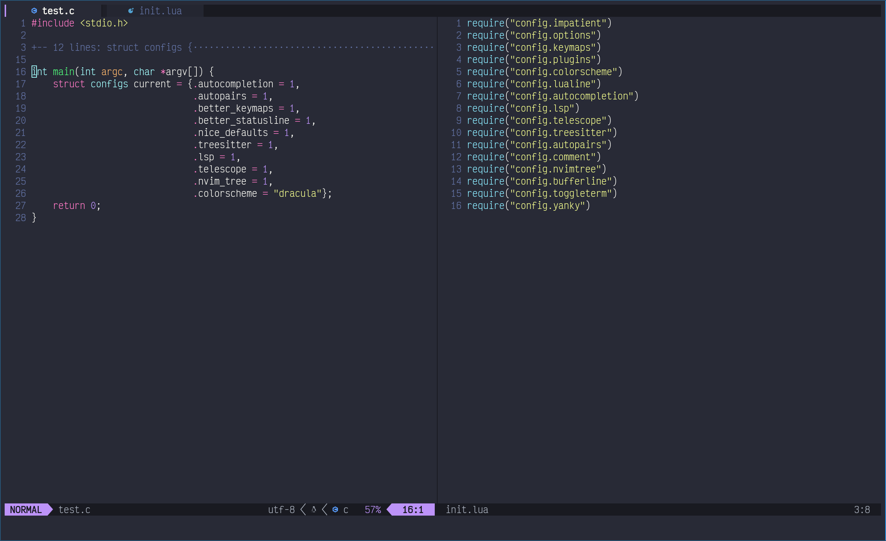
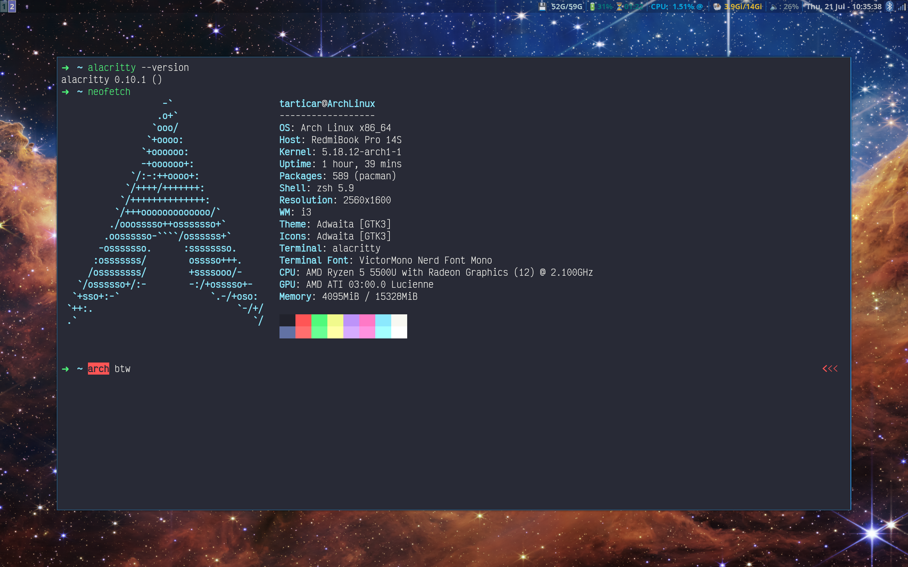

# bezlant.dotfiles

_Minimalistic configs from the Arch Linux workstation._

> - **_[Neovim](#neovim)_**

> - **_[Wezterm & Zsh](#wezterm-and-zsh)_**

> - **_[i3 with i3blocks & Rofi](#i3-i3blocks-and-rofi)_**

### Neovim

The config aims to be as small as possible, simply for comfortable coding without millions of popus and alarms going off. (Startup time is about 80ms)  
There is plenty of dependencies please run `:checkhealth` to see what you need.

##### Credits

[Neovim from Scratch](https://github.com/LunarVim/Neovim-from-scratch) - A lot of lua configurations picked up and learnt from here.  
[amix/vimrc](https://github.com/amix/vimrc) - My first vim config and my inspiration.  
[Drew Neil](https://github.com/nelstrom) - Most of my vim-fu learnt from his books & vimcasts.  
[MikhailKuzntsov1](https://github.com/MikhailKuzntsov1) - My fellow friend and inspiration to migrate to neovim.

### Wezterm and Zsh

> Fast and modern [terminal emulator](https://github.com/wez/wezterm) & [oh-my-zsh](https://github.com/ohmyzsh/ohmyzsh)

### i3-i3blocks and Rofi

> The [i3](https://github.com/Airblader/i3) mapping inspired by [LukeSmithxyz](https://gist.github.com/LukeSmithxyz/a7f790309ae17e00a5635dc5def05424)  
> Statusbar is [i3blocks](https://github.com/vivien/i3blocks) based on [this](https://github.com/miklhh/i3blocks-config) configuration  
> Dmenu is a hell to configure, so I use [this Rofi config](https://www.youtube.com/watch?v=TutfIwxSE_s)

